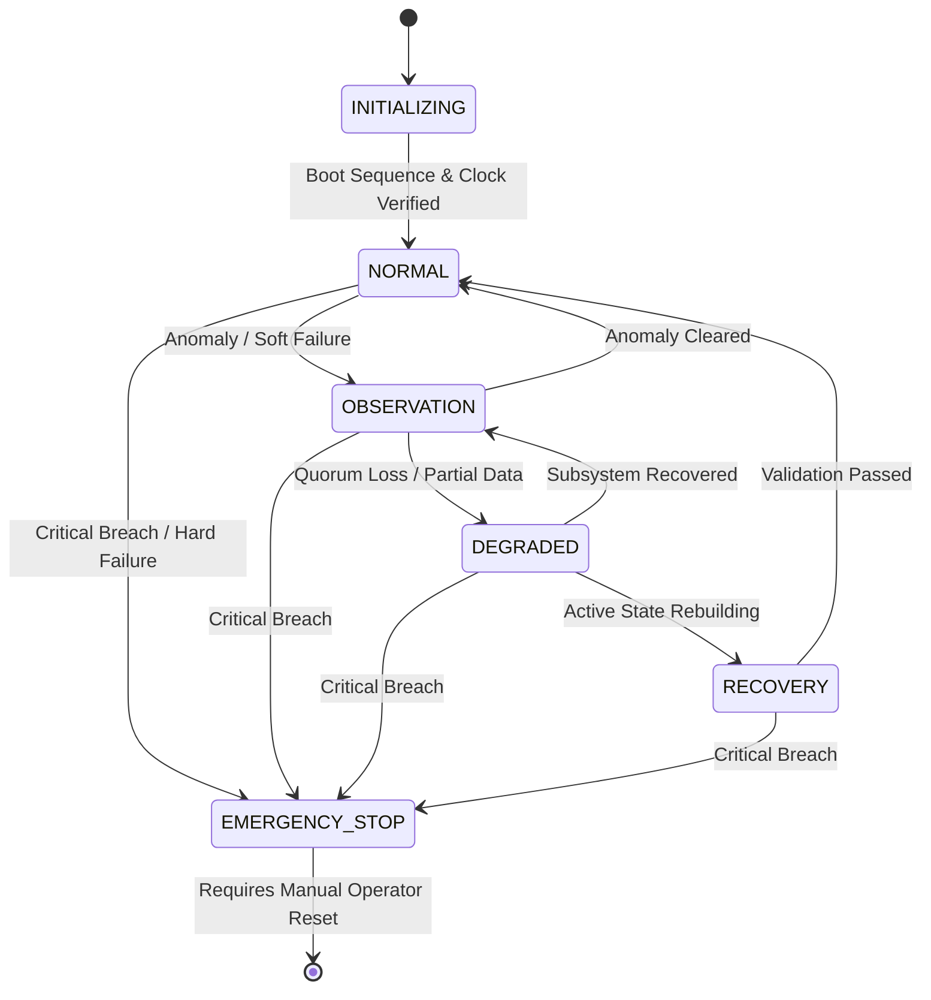

# DOCUMENT 110 — `110_RUNTIME_ARCHITECTURE.md`

> **Authority Level:** Level 1 (Semi-Immutable) | **Specification ID:** `RUN-001`
> 

## 1. Six Cognitive Runtime Layers (`RUN-002`)

* **Layer 1 (Data Platform - `SLS-100`):** Ingress (`L1-ING`), Feature Cache (`L1-FST`), Vector Memory (`L1-MEM`), Relational DB (`L1-RDB`). Ingests tick/macro telemetry; emits `CIO-01` and `CIO-02`.

* **Layer 2 (Specialized Agents - `SLS-200`):** Domain micro-agents (`L2-MAC`, `L2-MIC`, `L2-LIQ`, `L2-REG`, `L2-FOR`, `L2-BEH`). Emits DSmT belief masses `CIO-03`.

* **Layer 3 (World Model Kernel - `SLS-300` / `SLS-301`):** World Model Core (`L3-WRM`) and Scenario Simulator (`L3-SIM`). Fuses beliefs via DSmT PCR5 into `CIO-04` (WorldState) and simulates trajectory distributions `CIO-05A`.

* **Layer 4 (Decision Engine - `SLS-400` / `SLS-401` / `SLS-402`):** Synthesizer (`L4-FUS`), Optimizer (`L4-DEC`), Policy Engine (`L4-VAL`). Generates `CIO-05B`, solves risk-adjusted utility `CIO-06`, and enforces risk bounds `CIO-07`.

* **Layer 5 (Execution Gateway - `SLS-500`):** Order Gateway (`L5-EXE`). Manages order state machine (`CIO-08`), receives fills (`CIO-09`), and reconciles portfolio state (`CIO-10`).

* **Layer 6 (Learning & Adaptation - `SLS-600`):** Out-of-band calibration (`L6-OPT`). Brier scores agents to emit `CIO-11` discounting weights and `CIO-12` vector embeddings.

## 2. Operational State Model (`SYS-03`)

