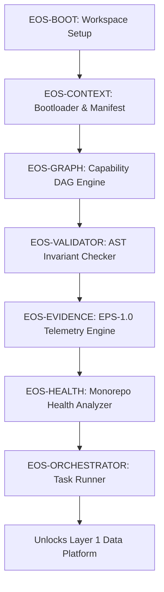

# DOCUMENT 120 — `120_ENGINEERING_OPERATING_SYSTEM.md`

> **Authority Level:** Level 2 (Standard) | **Specification ID:** `EOS-001`
> 

## 1. EOS Capability Toolchain (`EOS-002`)

1. **`EOS-BOOT`:** Verifies toolchain dependencies (`git`, `python3.11+`, `cargo`, `buf`, `uv`), creates skeleton, tags `m1.1-start`.

2. **`EOS-CONTEXT`:** Implements `afrp boot`. Parses manifest and `KERNEL.md`. Asserts word count $W \le 400$.

3. **`EOS-GRAPH`:** Implements `afrp plan`. Builds in-memory execution DAG, detects cycles, identifies next executable targets.

4. **`EOS-VALIDATOR`:** Implements `afrp validate`. Checks Python ASTs for bare `except:` and unannotated functions.

5. **`EOS-EVIDENCE`:** Implements `afrp evidence`. Audits file bounds and emits `ERS-1.0` evidence records.

6. **`EOS-HEALTH`:** Implements `afrp health`. Computes test coverage and TVM traceability coverage.

7. **`EOS-ORCHESTRATOR`:** Implements `afrp run`. Supervisory control plane executing Work Packages under EGP-2.0 controls.

## 2. Orchestrator Contract & Subsystem Spec (`EOS-003`)

### Core Responsibilities

* Inspects `03-engineering/CAPABILITY_REGISTRY.yaml` and resolves the execution DAG via `EOS-GRAPH`.

* Ingests assigned Work Package contracts (`05-work-packages/WP-IMP-XXXX.yaml`).

* Enforces EGP-2.0 handshake and SHA256 baseline verification against `00-governance/BASELINE_FINGERPRINT.yaml`.

* Grants write locks strictly to declared `bounded_files` upon successful precondition evaluation.

* Executes quality gates (`ruff`, `mypy --strict`, `pytest`, `buf`).

* Emits `ERS-1.0` evidence records (`EXEC-XXX.yaml`) and executes Git rollbacks on failure.
