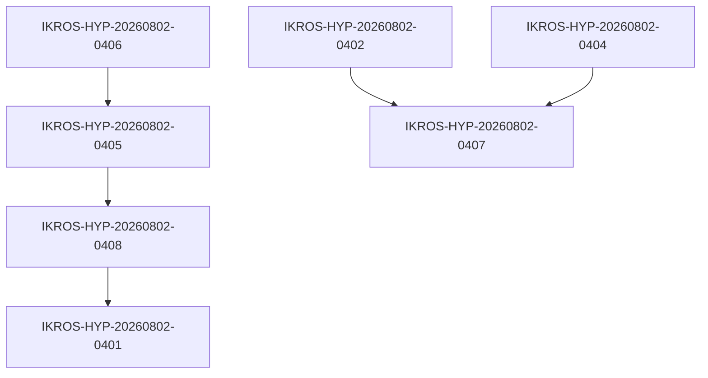

# Hypothesis Dependency Graph

```mermaid
graph TD
    IKROS-HYP-20260802-0405 --> IKROS-HYP-20260802-0408
    IKROS-HYP-20260802-0408 --> IKROS-HYP-20260802-0401
    IKROS-HYP-20260802-0402 --> IKROS-HYP-20260802-0407
    IKROS-HYP-20260802-0406 --> IKROS-HYP-20260802-0405
    IKROS-HYP-20260802-0404 --> IKROS-HYP-20260802-0407
```
