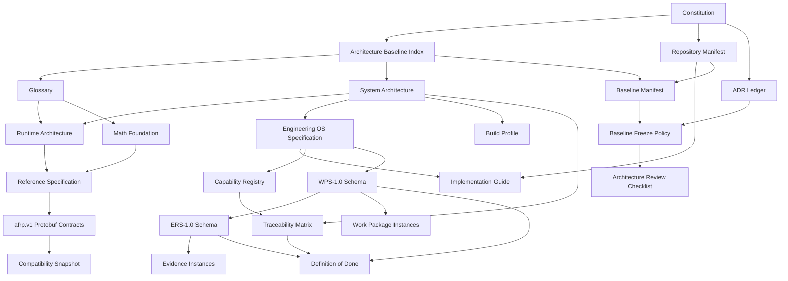

# AFRP Canonical Source and Dependency Map

The machine-readable ownership map is
[`CANONICAL_SOURCE_MAP.yaml`](CANONICAL_SOURCE_MAP.yaml). This document explains
the map without copying the owned content.

## 1. Findings

AFRP has modular canonical sources rather than a monolithic Architecture Bible or
Engineering Bible. Each engineering concern now has exactly one named owner:

| Concern | Canonical owner |
| --- | --- |
| Constitutional governance | `00-governance/000_ENGINEERING_CONSTITUTION.md` |
| Architecture baseline membership | `02-architecture/AFRP_BASELINE_v1.md` |
| Formal terminology | `02-architecture/050_FORMAL_SYSTEM_GLOSSARY.md` |
| Products, NFR, FIT, EDR | `02-architecture/100_SYSTEM_ARCHITECTURE.md` |
| Runtime layers and SYS-03 | `02-architecture/110_RUNTIME_ARCHITECTURE.md` |
| Mathematical truth | `02-architecture/130_MATHEMATICAL_FOUNDATION.md` |
| Conceptual envelope/CIO taxonomy | `02-architecture/200_REFERENCE_SPECIFICATION.md` |
| Executable wire contract | `proto/afrp/v1/` |
| EOS behavior | `03-engineering/120_ENGINEERING_OPERATING_SYSTEM.md` |
| Repository topology and document paths | `REPOSITORY_MANIFEST.yaml` |
| Build, toolchain, testing commands | `03-engineering/BUILD_PROFILE.yaml` |
| Capability lifecycle | `03-engineering/CAPABILITY_REGISTRY.yaml` |
| Requirement traceability | `03-engineering/TRACEABILITY_MATRIX.yaml` |
| Deprecation lifecycle | `03-engineering/DEPRECATION_POLICY.yaml` |
| Work Package shape | `09-validation/schemas/wps-1.0.schema.json` |
| Evidence shape | `09-validation/schemas/ers-1.0.schema.json` |
| AI engineer procedure | `04-ai-framework/AI_ENGINEER_PLAYBOOK.md` |
| Architecture decisions | `02-architecture/adr/` |
| Baseline membership/change control | Phase 1 documents under `docs/governance/` |

Work Packages instantiate WPS; evidence records instantiate ERS; source code implements
architecture; CI and build files execute BUILD_PROFILE. None of these subordinate
artifacts owns the rule it implements.

## 2. Dependency Map

## 3. Files Created in Step 2

- `docs/governance/CANONICAL_SOURCE_MAP.yaml`
- `docs/governance/CANONICAL_SOURCE_MAP.md`

## 4. Files Modified in Step 2

None.

## 5. Rationale

The mapping names existing owners and their dependency direction. It does not merge,
rewrite, or duplicate approved architecture.

## 6. Risks

- New summaries must not acquire normative language that competes with their owner.
- Changing an `owner` entry changes governance authority and therefore requires an ADR.
- Glob-owned instance families (`WP-*`, `EXEC-*`) remain governed by their schemas.

## 7. Completion Status

**STEP 2: COMPLETE**

Every mapped concern has one owner, and subordinate roles are explicit.
